# Chaos Crew Streamer Tools v6

## Architektur-Änderungen zu v5

**Problem v5:** Monolithische API → ein Prozess für alles, schwer zu skalieren/debuggen.

**Lösung v6:** Microservices. Jeder Dienst hat genau eine Aufgabe. Bridge entkoppelt Streamerbot von den Services via Redis Pub/Sub.

## Communication Flow

```mermaid
flowchart TB
    subgraph TWITCH["☁ TWITCH"]
        TW_CHAT["💬 Chat Messages"]
        TW_PRESENT["👥 Present Viewers<br/><i>every 60s</i>"]
        TW_IRC["📡 IRC WebSocket"]
    end

    subgraph WINDOWS["🖥 WINDOWS PC · 192.168.178.39"]
        subgraph SB["STREAMERBOT · :9090 WS Server"]
            SB_TICK["GW_A_ViewerTick.cs"]
            SB_CHAT["GW_B_ChatMessage.cs"]
            SB_TIME["GW_TimeInfo.cs · !time / !coin"]
            SB_TOP["GW_Leaderboard.cs · !top"]
            SB_REPLY["CC_ChatReply.cs"]
            SB_REG["CC_ApiRegister.cs"]
            SB_SO["CC_Shoutout.cs · !so"]
            SB_ALERTS["CC_Follow / CC_Cheer / CC_RaidBroadcaster"]
        end
        OBS["OBS Studio · Browser Sources → :80"]
    end

    subgraph SERVER["🐧 LXC SERVER · 192.168.178.34 · Docker"]
        BRIDGE["cc-bridge · :3000<br/>SB WS Client + Redis Router"]
        REDIS[("Redis :6379<br/>DB0=prod DB1=test")]
        subgraph SERVICES["Microservices"]
            GW["cc-giveaway · :3001<br/>Watchtime + WS"]
            SF["cc-spacefight · :3002<br/>Fight Engine + WS"]
            AL["cc-alerts · :3003<br/>Alert Overlays + Claude AI + WS"]
            ST["cc-stats · :3004<br/>Read-only PG REST"]
            ADM["cc-admin · :3005<br/>Admin Pages + Health"]
        end
        PG[("PostgreSQL :5432")]
        CADDY["Caddy :80<br/>/giveaway/* /spacefight/*<br/>/alerts/* /stats/* /admin/*"]
    end

    subgraph BROWSER["🌐 CLIENTS"]
        GW_ADMIN["GW Admin · /giveaway/giveaway-admin.html"]
        SF_ADMIN["SF Admin · /spacefight/spacefight-admin.html"]
        STATS["Stats · /stats/stats.html"]
        TEST["Test Console · /admin/giveaway-test.html"]
        GW_OV["GW Overlay · OBS"]
        JOIN_OV["Join Anim · OBS"]
        SF_OV["Spacefight · OBS"]
        CHAT_OV["HUD Chat · OBS"]
        ALERT_OV["Alerts · OBS"]
    end

    TW_PRESENT --> SB_TICK --> BRIDGE
    TW_CHAT --> SB_CHAT --> BRIDGE
    TW_CHAT --> SB_TIME --> BRIDGE
    TW_CHAT --> SB_SO

    BRIDGE -->|ch:giveaway| GW
    BRIDGE -->|ch:spacefight| SF
    BRIDGE -->|ch:alerts| AL
    BRIDGE -->|ch:chat| AL
    BRIDGE <-->|Redis| REDIS

    GW -->|ch:chat_reply| BRIDGE --> SB_REPLY -->|CPH.SendMessage| TW_CHAT
    SB_REG -.->|cc_api_session GlobalVar| SB_REG
    BRIDGE -->|cc_api_register| SB_REG

    SB_ALERTS -->|follow/cheer/raid| BRIDGE
    SB_TOP -->|HTTP GET /stats/api/leaderboard| ST
    SB_TOP -->|CPH.SendMessage| TW_CHAT

    GW <--> REDIS
    GW <--> PG
    SF <--> REDIS
    SF <--> PG
    ST --> PG

    GW <-->|WS /giveaway/ws| GW_ADMIN
    GW <-->|WS /giveaway/ws| TEST
    GW -->|WS broadcasts| GW_OV
    GW -->|WS broadcasts| JOIN_OV
    SF <-->|WS /spacefight/ws| SF_ADMIN
    SF -->|WS broadcasts| SF_OV
    AL <-->|WS /alerts/ws| ALERT_OV
    ST -->|REST| STATS

    TW_IRC <-->|IRC WS| CHAT_OV
    CADDY --> OBS
    CADDY --> BROWSER

    classDef twitch fill:#9146FF,stroke:#7B2FE0,color:#fff
    classDef sb fill:#2D5A27,stroke:#1A3A15,color:#fff
    classDef svc fill:#0D3B66,stroke:#082B4F,color:#fff
    classDef db fill:#1A1A2E,stroke:#16213E,color:#C8DCE8
    classDef browser fill:#0A1628,stroke:#0D2137,color:#C8DCE8
    classDef overlay fill:#1A0A28,stroke:#2D1040,color:#C8DCE8

    class TW_CHAT,TW_PRESENT,TW_IRC twitch
    class SB_TICK,SB_CHAT,SB_TIME,SB_TOP,SB_REPLY,SB_REG,SB_SO,SB_ALERTS sb
    class BRIDGE,GW,SF,AL,ST,ADM svc
    class REDIS,PG db
    class GW_ADMIN,SF_ADMIN,STATS,TEST browser
    class GW_OV,JOIN_OV,SF_OV,CHAT_OV,ALERT_OV overlay
```



### Event Message Reference

#### Streamerbot → API (WS :9090)

| # | Event | Payload | When |
|---|-------|---------|------|
| ① | `viewer_tick` | `{ event, user, ts }` | Every 60s per present viewer |
| ② | `chat_msg` | `{ event, user, message, ts }` | Every chat message |
| ③ | `time_cmd` | `{ event, user }` | Viewer types `!time` or `!coin` |
| | `fight_cmd` | `{ event, attacker, defender }` | Viewer types `!fight @user` |
| | `stream_online` | `{ event }` | Stream starts |
| | `stream_offline` | `{ event }` | Stream ends |
| | `spacefight_result` | `{ event, winner, loser, ship_w, ship_l, ts }` | Fight animation ends |

#### API → Streamerbot (WS :9090)

| # | Event | Payload | When |
|---|-------|---------|------|
| ④ | `chat_reply` | `{ event, user, message }` | Response to `!time`, rejected fights, etc. |
| | `cc_api_register` | `{ event }` | API connects (once on startup) |

#### API → Browser Clients (WS :9091 broadcast)

| # | Event | Payload | When |
|---|-------|---------|------|
| ⑤ | `wt_update` | `{ event, user, watchSec, coins }` | After each viewer_tick or chat bonus |
| ⑥ | `gw_join` | `{ event, user }` | New participant registered via keyword |
| ⑦ | `gw_status` | `{ event, status: "open"/"closed" }` | Giveaway opened/closed |
| ⑧ | `gw_data` | `{ event, open, session, participants[] }` | Response to `gw_get_all` |
| | `gw_ack` | `{ event, type, ... }` | Response to admin commands |
| | `sf_status` | `{ event, live }` | Stream online/offline state |
| | `gw_overlay` | `{ event, open, total, tickets, top5[], winner }` | Overlay data push |

#### Browser → API (WS :9091 commands)

| Event | Payload | Used by |
|-------|---------|---------|
| `gw_get_all` | `{ event }` | Admin, Test Console |
| `gw_cmd` | `{ event, cmd, [user], [keyword] }` | Admin Panel |
| `sf_status_request` | `{ event }` | Spacefight Overlay |

#### Admin Commands (`gw_cmd`)

| cmd | Extra fields | Effect |
|-----|-------------|--------|
| `gw_open` | `keyword?` | Open giveaway |
| `gw_close` | | Close giveaway, end session |
| `gw_set_keyword` | `keyword` | Set/clear participation keyword |
| `gw_get_keyword` | | Query current keyword |
| `gw_add_ticket` | `user` | +7200s watchtime (= +1 coin) |
| `gw_sub_ticket` | `user` | -7200s watchtime (= -1 coin) |
| `gw_ban` | `user` | Ban from giveaway |
| `gw_unban` | `user` | Remove ban |
| `gw_reset` | | Clear all data, close session |

#### REST API Endpoints

**Giveaway** (`/giveaway/api/...`)

| Method | Path | Response |
|--------|------|----------|
| GET | `/giveaway/health` | `{ status, service, session, redis, pg }` |
| GET | `/giveaway/api/participants` | `{ session, open, participants[] }` |
| GET | `/giveaway/api/user/:username` | `{ username, watchSec, coins, registered, banned, lifetime }` |
| GET | `/giveaway/api/sessions?limit=` | `[{ id, opened_at, closed_at, winner, ... }]` |
| GET | `/giveaway/api/leaderboard?limit=` | `[{ display, total_tickets, total_watch_sec, times_won }]` |

**Spacefight** (`/spacefight/api/...`)

| Method | Path | Response |
|--------|------|----------|
| GET | `/spacefight/api/spacefight/leaderboard?limit=` | `[{ username, wins, losses, ratio, last_fight }]` |
| GET | `/spacefight/api/spacefight/history?limit=` | `[{ winner, loser, ship_w, ship_l, ts }]` |
| GET | `/spacefight/api/spacefight/player/:name` | `{ username, wins, losses, ratio, rank }` |
| POST | `/spacefight/api/spacefight` | Save fight result |

**Alerts** (`/alerts/api/...`)

| Method | Path | Response |
|--------|------|----------|
| POST | `/alerts/api/chat/send` | Send Twitch chat message |
| GET | `/alerts/api/twitch/user/:login` | Twitch user profile (cached) |
| POST | `/alerts/api/claude/summary` | AI summary `{ type, user, game, bio }` → `{ summary }` |

**Stats** (`/stats/api/...`)

| Method | Path | Response |
|--------|------|----------|
| GET | `/stats/api/sessions?limit=` | `[{ id, opened_at, closed_at, winner, ... }]` |
| GET | `/stats/api/leaderboard?limit=` | `[{ display, total_tickets, total_watch_sec, times_won }]` |
| GET | `/stats/api/spacefight/leaderboard?limit=` | `[{ username, wins, losses, ratio }]` |
| GET | `/stats/api/spacefight/history?limit=` | `[{ winner, loser, ts }]` |
| GET | `/stats/api/spacefight/player/:name` | `{ username, wins, losses, ratio, rank }` |

**Aggregated**

| Method | Path | Response |
|--------|------|----------|
| GET | `/health` | `{ status, services: { bridge, giveaway, ... } }` |

## Services

| Container | Port | Beschreibung |
|---|---|---|
| cc-bridge | 3000 | Streamerbot WS Client → Redis Pub/Sub Router |
| cc-giveaway | 3001 | Watchtime Engine + REST + WS Admin |
| cc-spacefight | 3002 | Fight Engine + REST + WS Admin |
| cc-alerts | 3003 | Alert Overlays + Claude AI + REST + WS |
| cc-stats | 3004 | Read-only Statistiken (REST only, kein WS) |
| cc-admin | 3005 | Admin Dashboard + Aggregated Health |
| cc-web (Caddy) | 80/443 | Reverse Proxy (path-based routing) |
| cc-postgres | 5432 | Persistente Daten |
| cc-redis | 6379 | Live-State (DB 0 = Prod, DB 1 = Test) |
| cc-redis-ui | 8081 | Redis Commander |
| cc-backup | – | Taegliches Backup um 03:00 |

## Vollstaendige Setup-Anleitung

### Voraussetzungen

| Was | Version | Wo |
|-----|---------|-----|
| Docker + Docker Compose | 20+ / v2+ | Auf dem Server (LXC, VM oder Bare-Metal) |
| Streamer.bot | **1.0.4** | Auf dem Windows-Streaming-PC |
| OBS Studio | 29+ | Auf dem Windows-Streaming-PC |
| Node.js | 20+ | Nur fuer Tests (optional, nicht fuer Produktion) |

### Netzwerk-Uebersicht

```
Windows-PC (Streamer.bot + OBS)          Server (Docker)
┌─────────────────────────────┐          ┌──────────────────────────────┐
│ Streamer.bot 1.0.4          │          │ Caddy        :80/:443        │
│   WS Server :9090     ◄─────┼── WS ───┼─► API         :3000 (REST)   │
│   C# Actions senden Events  │          │              :9091 (Browser) │
│                             │          │ Redis        :6379           │
│ OBS Studio                  │          │ PostgreSQL   :5432           │
│   Browser Sources ──────────┼── HTTP ──┼─► Caddy → /srv/web/         │
│   zeigen auf :80            │          │ Redis CMD    :8081           │
└─────────────────────────────┘          └──────────────────────────────┘
```

**Wichtig:** `192.168.178.39` = Windows-PC (Streamer.bot), `192.168.178.34` = Server (Docker). Eigene IPs in `.env` eintragen.

---

### Schritt 1: Server aufsetzen (Docker)

```bash
# 1. Repository klonen
git clone <repo-url> chaos-crew-v5
cd chaos-crew-v5

# 2. Environment konfigurieren
cp .env.example .env
```

Die `.env` Datei anpassen:

```env
# IP des Windows-PCs auf dem Streamer.bot laeuft
SB_HOST=192.168.178.39
SB_PORT=9090

# PostgreSQL Zugangsdaten (eigenes Passwort setzen!)
PG_DB=chaoscrew
PG_USER=chaoscrew
PG_PASSWORD=HIER_SICHERES_PASSWORT

# Redis Commander Login
REDIS_UI_USER=chaos
REDIS_UI_PASSWORD=HIER_ANDERES_PASSWORT

# Domain (leer lassen fuer lokales Netzwerk = nur HTTP Port 80)
DOMAIN=

# Caddy Config: "Caddyfile" fuer HTTP, "Caddyfile.ssl" fuer HTTPS mit Domain
CADDY_CONFIG=Caddyfile
```

```bash
# 3. Stack starten
docker compose up -d

# 4. Pruefen ob alles laeuft
docker compose ps
# Alle Container sollten "Up (healthy)" zeigen

# 5. Health-Check
curl http://localhost:3000/health
# Erwartet: {"status":"ok","session":null,"redis":"ok","pg":"ok"}
```

**Container die laufen muessen:**

| Container | Image | Funktion |
|-----------|-------|----------|
| `cc-bridge` | node:20-alpine | Streamerbot WS → Redis Pub/Sub |
| `cc-giveaway` | node:20-alpine | Watchtime Engine + WS |
| `cc-spacefight` | node:20-alpine | Fight Engine + WS |
| `cc-alerts` | node:20-alpine | Alert Overlays + Claude AI |
| `cc-stats` | node:20-alpine | Read-only Stats REST |
| `cc-admin` | node:20-alpine | Admin Dashboard + Health |
| `cc-postgres` | postgres:16-alpine | Persistente Daten |
| `cc-redis` | redis:7-alpine | Live-State |
| `cc-web` | caddy (custom) | Webserver + Reverse Proxy |
| `cc-backup` | postgres:16-alpine | Taegliches Backup um 03:00 |
| `cc-redis-ui` | rediscommander | Redis Admin UI |

**Troubleshooting:**
```bash
# Logs anschauen
docker compose logs -f bridge
docker compose logs -f giveaway
docker compose logs -f spacefight
docker compose logs -f alerts
docker compose logs -f stats
docker compose logs -f postgres

# Neustart eines Services
docker compose restart giveaway

# Alles neu bauen (nach Code-Aenderungen)
docker compose up -d --build
```

---

### Schritt 2: Streamer.bot 1.0.4 einrichten

#### 2.1 WebSocket Server aktivieren

1. Streamer.bot oeffnen
2. **Servers/Clients** Tab oeffnen (links im Hauptfenster)
3. **WebSocket Server** Sektion:
   - **Auto Start**: aktivieren (Haken setzen)
   - **Address**: `0.0.0.0`
   - **Port**: `9090`
   - **Start Server** klicken
4. Status muss `Listening` zeigen

> Die API verbindet sich automatisch zu `ws://SB_HOST:9090` und registriert sich. Im API-Log erscheint `[SB] Connected`.

#### 2.2 Actions anlegen

Fuer jede Action:
1. **Actions** Tab → Rechtsklick → **Add**
2. Name exakt wie angegeben eingeben
3. Rechtsklick auf die neue Action → **Add Sub-Action** → **Core** → **C# → Execute C# Code**
4. Code aus der jeweiligen `.cs` Datei kopieren und einfuegen
5. Im C# Editor: **References** Tab → sicherstellen dass `Newtonsoft.Json.dll` vorhanden ist (Streamer.bot 1.0.4 hat das standardmaessig)
6. **Save & Compile** klicken → muss `Compiled successfully!` zeigen
7. Trigger wie angegeben hinzufuegen

---

#### Action 1: `CC – API Register`

| | |
|---|---|
| **Datei** | `streamerbot/CC_ApiRegister.cs` |
| **Name in Streamer.bot** | `CC – API Register` |
| **Trigger** | Core → WebSocket → Custom Server → Message |
| **Queue** | Keine (Default/None) |
| **Zweck** | Speichert die Session-ID wenn sich die API verbindet |

**Trigger einrichten:**
1. Action auswaehlen → **Triggers** Tab
2. Rechtsklick → **Core** → **WebSocket** → **Custom Server** → **Message**
3. Keine Filter noetig – die Action prueft intern auf `cc_api_register`

**Was passiert:** Die API sendet beim Start `{ event: "cc_api_register" }` an Streamerbots WS-Server. Diese Action speichert die `sessionId` als GlobalVar `cc_api_session`. Alle anderen Actions nutzen diese Session-ID um Events gezielt an die API zu senden.

---

#### Action 2: `CC – Chat Reply Handler`

| | |
|---|---|
| **Datei** | `streamerbot/CC_ChatReply.cs` |
| **Name in Streamer.bot** | `CC – Chat Reply Handler` |
| **Trigger** | Core → WebSocket → Custom Server → Message |
| **Queue** | Keine (Default/None) |
| **Zweck** | Empfaengt `chat_reply` von der API und sendet sie in den Twitch-Chat |

**Trigger einrichten:**
1. Action auswaehlen → **Triggers** Tab
2. Rechtsklick → **Core** → **WebSocket** → **Custom Server** → **Message**
3. Keine Filter – die Action prueft intern auf `event: "chat_reply"`

**Was passiert:** Wenn ein Viewer `!time` oder `!coin` im Chat tippt, berechnet die API die Antwort und sendet sie als `chat_reply` zurueck. Diese Action nimmt die Nachricht und schickt sie via `CPH.SendMessage()` in den Twitch-Chat.

> **Hinweis:** `CC – API Register` und `CC – Chat Reply Handler` nutzen den gleichen Trigger-Typ. Streamer.bot fuehrt BEIDE Actions aus wenn eine WS-Nachricht kommt – jede Action prueft intern welches Event sie verarbeitet.

---

#### Action 3: `GW – Viewer Tick`

| | |
|---|---|
| **Datei** | `streamerbot/GW_A_ViewerTick.cs` |
| **Name in Streamer.bot** | `GW – Viewer Tick` |
| **Trigger** | Twitch → Present Viewer |
| **Queue** | **Empfohlen: Eigene Queue** (siehe unten) |
| **Zweck** | Meldet der API welche Viewer im Chat praesent sind (+60s/Tick) |

**Trigger einrichten:**
1. Action auswaehlen → **Triggers** Tab
2. Rechtsklick → **Twitch** → **Present Viewers**
3. Keine weiteren Einstellungen noetig

**Queue einrichten (empfohlen):**
1. **Queues** Tab → Rechtsklick → **Add Queue**
2. Name: `GW Viewer Queue`
3. **Blocking**: Nein (Non-Blocking)
4. Zurueck zur Action → **Action** Sektion → **Queue**: `GW Viewer Queue` auswaehlen

> **Warum eine Queue?** Der Present Viewer Trigger feuert fuer JEDEN Viewer gleichzeitig. Ohne Queue koennen bei vielen Viewern Race Conditions entstehen. Eine Non-Blocking Queue stellt sicher, dass Events ordentlich abgearbeitet werden.

**Was passiert:** Alle 60 Sekunden prueft Twitch welche Viewer im Chat sind. Streamer.bot feuert fuer jeden Viewer ein Event. Diese Action filtert Bots raus, prueft ob der Stream laeuft (`CPH.ObsIsStreaming`), und sendet `{ event: "viewer_tick", user: "username", ts: epoch }` an die API.

**Wichtig:**
- Funktioniert NUR wenn OBS verbunden ist und streamt (wegen `CPH.ObsIsStreaming(0)`)
- Bot-Filter: streamelements, nightbot, moobot, fossabot, wizebot, botrixoficial, commanderroot

---

#### Action 4: `GW – Chat Message`

| | |
|---|---|
| **Datei** | `streamerbot/GW_B_ChatMessage.cs` |
| **Name in Streamer.bot** | `GW – Chat Message` |
| **Trigger** | Twitch → Chat → Chat Message |
| **Queue** | **Empfohlen: Eigene Queue** (siehe unten) |
| **Zweck** | Leitet Chat-Nachrichten an die API weiter (Keyword-Check + Chat-Bonus) |

**Trigger einrichten:**
1. Action auswaehlen → **Triggers** Tab
2. Rechtsklick → **Twitch** → **Chat** → **Chat Message**
3. Keine Filter – ALLE Chat-Nachrichten werden weitergeleitet

**Queue einrichten (empfohlen):**
1. **Queues** Tab → Rechtsklick → **Add Queue**
2. Name: `GW Chat Queue`
3. **Blocking**: Nein (Non-Blocking)
4. Zurueck zur Action → **Action** Sektion → **Queue**: `GW Chat Queue` auswaehlen

**Was passiert:** Jede Chat-Nachricht wird an die API geschickt als `{ event: "chat_msg", user: "username", message: "text", ts: epoch }`. Die API entscheidet:
- Ist es das Keyword? → Registrierung
- Hat der User 5+ Woerter geschrieben? → +5s Chat-Bonus (10s Cooldown)
- Nachrichten werden auf 500 Zeichen gekuerzt

---

#### Action 5: `GW – Time Info`

| | |
|---|---|
| **Datei** | `streamerbot/GW_TimeInfo.cs` |
| **Name in Streamer.bot** | `GW – Time Info` |
| **Trigger** | Core → Commands → Command (2 Commands!) |
| **Queue** | Keine (Default/None) |
| **Zweck** | Viewer fragt Watchtime ab: `!time` oder `!coin` im Chat |

**Trigger einrichten – 2 Commands anlegen:**

**Command 1: `!time`**
1. **Commands** Tab → Rechtsklick → **Add Command**
2. **Command**: `!time`
3. **Location**: Chat
4. **Enabled**: Ja
5. **Cooldown**: User: `5s`, Global: `0s`
6. **Permission**: Everyone
7. Zurueck zur Action → **Triggers** Tab → Rechtsklick → **Core** → **Commands** → `!time` auswaehlen

**Command 2: `!coin`**
1. **Commands** Tab → Rechtsklick → **Add Command**
2. **Command**: `!coin`
3. **Location**: Chat
4. **Enabled**: Ja
5. **Cooldown**: User: `5s`, Global: `0s`
6. **Permission**: Everyone
7. Zur gleichen Action → **Triggers** Tab → Rechtsklick → **Core** → **Commands** → `!coin` hinzufuegen

**Was passiert:** Die Action sendet `{ event: "time_cmd", user: "username" }` an die API. Die API berechnet Watchtime + Coins und sendet eine `chat_reply` zurueck, die vom `CC – Chat Reply Handler` in den Chat geschrieben wird.

**Chat-Ausgabe Beispiel:**
```
@deimos Watchtime: 2h 15m | Coins: 1.13 | Naechstes Coin in ca. 1h 45m
```

---

#### Action 6: `CC – Shoutout`

| | |
|---|---|
| **Datei** | `streamerbot/CC_Shoutout.cs` |
| **Name in Streamer.bot** | `CC – Shoutout` |
| **Trigger** | Core → Commands → Command |
| **Queue** | Keine (Default/None) |
| **Zweck** | `!so @username` sendet Shoutout in Chat + nativer Twitch-Shoutout |

**Command anlegen:**
1. **Commands** Tab → Rechtsklick → **Add Command**
2. **Command**: `!so`
3. **Location**: Chat
4. **Enabled**: Ja
5. **Cooldown**: User: `10s`, Global: `0s`
6. **Permission**: **Moderator** (nicht Everyone!)
7. Zurueck zur Action → **Triggers** Tab → Rechtsklick → **Core** → **Commands** → `!so` auswaehlen

**Was passiert:** Moderatoren und Broadcaster koennen `!so @username` im Chat tippen. Die Action sendet eine Chat-Nachricht (`Besucht den Kanal von @username!`) und loest den nativen Twitch-Shoutout aus.

---

### 2.3 Queues Uebersicht

| Queue Name | Typ | Fuer welche Action |
|---|---|---|
| `GW Viewer Queue` | Non-Blocking | `GW – Viewer Tick` |
| `GW Chat Queue` | Non-Blocking | `GW – Chat Message` |
| *(Default/None)* | – | Alle anderen Actions |

**So legst du eine Queue an:**
1. Im Hauptfenster links: **Queues** Tab
2. Rechtsklick → **Add Queue**
3. Name eingeben
4. **Blocking**: `No` (Non-Blocking)
5. Action zuweisen: Action oeffnen → oben im **Action** Panel → **Queue** Dropdown → Queue auswaehlen

> **Blocking vs Non-Blocking:**
> - **Non-Blocking**: Events werden in Reihenfolge abgearbeitet, aber das System blockiert nicht auf Ergebnisse. Perfekt fuer Viewer Ticks und Chat-Nachrichten.
> - **Blocking**: Naechstes Event wartet bis das vorherige fertig ist. Nicht noetig hier.

---

### 2.4 Streamer.bot Einstellungen

#### Twitch Account Verbindung

1. **Platforms** Tab → **Twitch** → **Accounts**
2. **Broadcaster Account** verbinden (Login mit deinem Twitch-Account)
3. **Bot Account** (optional): Separater Account fuer Chat-Nachrichten
4. Beide auf **Auto Connect** setzen

#### OBS Verbindung

1. **Stream Apps** Tab → **OBS** → **OBS v5 WebSocket**
2. **Host**: `127.0.0.1` (OBS laeuft auf dem gleichen PC)
3. **Port**: `4455` (Standard OBS WebSocket Port)
4. **Password**: Das Passwort aus OBS → Tools → WebSocket Server Settings
5. **Auto Connect on Startup**: aktivieren
6. **Reconnect on Disconnect**: aktivieren

> **Wichtig:** `CPH.ObsIsStreaming(0)` in den C# Actions prueft ob OBS verbunden ist und streamt. Ohne OBS-Verbindung werden KEINE Viewer Ticks oder Chat Messages weitergeleitet!

#### WebSocket Server (Wiederholung)

1. **Servers/Clients** → **WebSocket Server**
2. **Address**: `0.0.0.0`
3. **Port**: `9090`
4. **Auto Start**: Ja
5. Server starten

#### Global Variables (werden automatisch gesetzt)

| Variable | Typ | Gesetzt von | Wert |
|---|---|---|---|
| `cc_api_session` | String | `CC – API Register` | Session-ID der API-Verbindung |

> Du musst diese Variable NICHT manuell anlegen. Sie wird automatisch gesetzt sobald die API sich verbindet.

---

### 2.5 Zusammenfassung: Alle Actions auf einen Blick

| # | Action Name | C# Datei | Trigger | Queue | Command |
|---|---|---|---|---|---|
| 1 | CC – API Register | `CC_ApiRegister.cs` | WS Custom Server Message | None | – |
| 2 | CC – Chat Reply Handler | `CC_ChatReply.cs` | WS Custom Server Message | None | – |
| 3 | CC – Alert Register | `CC_AlertRegister.cs` | WS Custom Server Message | None | – |
| 4 | GW – Viewer Tick | `GW_A_ViewerTick.cs` | Twitch Present Viewer | GW Viewer Queue | – |
| 5 | GW – Chat Message | `GW_B_ChatMessage.cs` | Twitch Chat Message | GW Chat Queue | – |
| 6 | GW – Time Info | `GW_TimeInfo.cs` | Core Command | None | `!time`, `!coin` |
| 7 | GW – Leaderboard | `GW_Leaderboard.cs` | Core Command | None | `!top` (Everyone) |
| 8 | CC – Shoutout | `CC_Shoutout.cs` | Core Command | None | `!so` (Mod only) |
| 9 | CC – Follow | `CC_Follow.cs` | Twitch Follow | None | – |
| 10 | CC – Cheer | `CC_Cheer.cs` | Twitch Cheer/Bits | None | – |
| 11 | CC – Raid Broadcaster | `CC_RaidBroadcaster.cs` | Twitch Raid | None | – |
| 12 | CC – First Chatter | `CC_FirstChatter.cs` | Twitch Chat Message | None | – |
| 13 | CC – Clip Created | `CC_ClipCreated.cs` | Clip Created | None | – |
| 14 | CC – Ad Break Start | `CC_AdBreakStart.cs` | Ad Break Start | None | – |
| 15 | CC – Ad Break End | `CC_AdBreakEnd.cs` | Ad Break End | None | – |

---

### Schritt 3: OBS Studio einrichten

#### 3.1 WebSocket Server aktivieren

1. OBS → **Tools** → **WebSocket Server Settings**
2. **Enable WebSocket Server**: aktivieren
3. **Server Port**: `4455` (Standard)
4. **Enable Authentication**: aktivieren
5. Passwort notieren → in Streamer.bot OBS-Verbindung eintragen

#### 3.2 Browser Sources anlegen

Fuer jedes Overlay eine **Browser Source** in OBS anlegen:

---

**Giveaway Overlay** (Teilnehmerliste + Top 5)

| Einstellung | Wert |
|---|---|
| Name | `GW Overlay` |
| URL | `http://192.168.178.34/giveaway/giveaway-overlay.html` |
| Breite | `320` |
| Hoehe | `400` |
| FPS | `30` |

> **Test-Modus:** `?test=1`

---

**Join Animation** (Teilnahme-Animation wenn jemand das Keyword tippt)

| Einstellung | Wert |
|---|---|
| Name | `GW Join Animation` |
| URL | `http://192.168.178.34/giveaway/giveaway-join.html` |
| Breite | `620` |
| Hoehe | `110` |
| FPS | `30` |

> **Test-Modus:** `http://192.168.178.34/giveaway/giveaway-join.html?test=1`

---

**Spacefight / Raumkampf** (Chat-Game: !fight @user)

| Einstellung | Wert |
|---|---|
| Name | `Raumkampf` |
| URL | `http://192.168.178.34/spacefight/spacefight.html` |
| Breite | `1920` |
| Hoehe | `1080` |
| FPS | `60` |

> **URL-Parameter:**
> - `?host=192.168.178.39&port=9090` – WS zum Streamerbot (fuer Chat-Commands)
> - `&channel=justcallmedeimos` – Twitch-Kanal fuer IRC Chat-Tracking
> - `&forcelive=1` – Stream-Check ueberspringen (zum Testen)
> - `&test=1` – Demo-Kaempfe abspielen
>
> **Komplett-URL Produktion:**
> ```
> http://192.168.178.34/spacefight/spacefight.html?host=192.168.178.39&port=9090&channel=DEIN_KANAL
> ```
>
> **Komplett-URL Test:**
> ```
> http://192.168.178.34/spacefight/spacefight.html?test=1
> ```

---

**HUD Chat** (Twitch Chat im Sci-Fi Stil)

| Einstellung | Wert |
|---|---|
| Name | `HUD Chat` |
| URL | `http://192.168.178.34/alerts/chat.html?channel=DEIN_KANAL` |
| Breite | `500` |
| Hoehe | `600` |
| FPS | `30` |

> **Wichtig:** `?channel=DEIN_KANAL` ersetzen mit deinem Twitch-Kanalnamen (lowercase).

---

**Alert Bar** (Follow, Sub, Bits, Raid usw.)

| Einstellung | Wert |
|---|---|
| Name | `Alerts` |
| URL | `http://192.168.178.34/alerts/alerts.html` |
| Breite | `1920` |
| Hoehe | `200` |
| FPS | `30` |

> OBS: **"Control audio via OBS"** aktivieren damit Sounds im Mixer erscheinen.

---

**Raid Info** (Rechtes Panel mit AI-Zusammenfassung)

| Einstellung | Wert |
|---|---|
| Name | `Raid Info` |
| URL | `http://192.168.178.34/alerts/raid-info.html` |
| Breite | `400` |
| Hoehe | `600` |
| FPS | `30` |

---

**Shoutout Info** (Rechtes Panel mit AI-Zusammenfassung)

| Einstellung | Wert |
|---|---|
| Name | `Shoutout Info` |
| URL | `http://192.168.178.34/alerts/shoutout-info.html` |
| Breite | `400` |
| Hoehe | `600` |
| FPS | `30` |

---

#### 3.3 OBS Szenen-Empfehlung

```
Szene: Stream
├── Webcam / Game Capture
├── Browser: HUD Chat              (Position: rechts unten)
├── Browser: GW Overlay            (Position: links, nur wenn Giveaway aktiv)
├── Browser: GW Join Animation     (Position: oben mitte, nur wenn Giveaway aktiv)
└── Browser: Raumkampf             (Position: Vollbild, transparent wenn kein Kampf)
```

> **Tipp:** Alle Overlays haben transparenten Hintergrund. Sie zeigen nur etwas an wenn ein Event aktiv ist. Du kannst sie also dauerhaft in der Szene lassen.

---

### Schritt 4: Funktionstest

#### 4.1 Server pruefen

```bash
# Aggregated Health (alle Services)
curl http://192.168.178.34/health
# Erwartet: {"status":"ok","services":{"bridge":"ok","giveaway":"ok",...}}

# Einzelne Services
curl http://192.168.178.34/giveaway/health
curl http://192.168.178.34/stats/health

# Web-Oberflaeche oeffnen
# Browser: http://192.168.178.34/
# → Chaos Crew Admin Dashboard muss erscheinen
```

#### 4.2 Streamer.bot Verbindung pruefen

```bash
# Bridge Logs anschauen
docker compose logs -f bridge
# Erwartet: [SB] Connected
#           [SB] ← cc_api_register → [ch:giveaway, ...]
```

In Streamer.bot unter **Servers/Clients** → **WebSocket Server** → **Sessions** sollte eine aktive Verbindung von der Server-IP erscheinen.

#### 4.3 Giveaway testen (ohne Stream)

1. Browser: `http://192.168.178.34/admin/giveaway-test.html` oeffnen
2. **VERBINDEN** klicken
3. **OEFFNEN** klicken → Giveaway ist offen
4. Keyword setzen: `!mitmachen` → **SETZEN**
5. Chat-Nachricht simulieren: Username `TestViewer`, Nachricht `!mitmachen` → **KEYWORD SENDEN**
6. Viewer Ticks simulieren: Username `TestViewer`, Anzahl `120` → **TICKS SENDEN**
7. **DATEN LADEN** → TestViewer sollte mit 1.0 Coins erscheinen

#### 4.4 Spacefight testen (ohne Stream)

1. Browser: `http://192.168.178.34/spacefight/spacefight.html?test=1` oeffnen
2. Demo-Kaempfe sollten automatisch starten
3. Admin: `http://192.168.178.34/spacefight/spacefight-admin.html` oeffnen

#### 4.5 Unit Tests ausfuehren (kein Docker noetig)

```bash
node --test tests/console-unit-tests.js tests/watchtime.test.js tests/integration.test.js
# Erwartet: 218 pass, 0 fail
```

---

### Schritt 5: Live gehen

1. **OBS** starten und Stream starten
2. **Streamer.bot** starten (sollte auto-connect zu Twitch + OBS + WS)
3. Im Bridge-Log pruefen: `docker compose logs -f bridge` → `[SB] Connected`
4. Admin Dashboard oeffnen: `http://192.168.178.34/` (→ `/admin/`)
5. Giveaway Admin: `http://192.168.178.34/giveaway/giveaway-admin.html`
6. Keyword setzen (z.B. `!mitmachen`) → Giveaway oeffnen
7. Viewer tippen `!mitmachen` im Chat → Registrierung
8. Viewer Ticks laufen automatisch → Watchtime + Coins steigen
9. `!time` im Chat → Bot antwortet mit Watchtime + Coins
10. `!top` im Chat → Bot postet Top 3 Leaderboard
11. Gewinner ziehen wenn fertig

## Tests

```bash
# Alle Tests auf einmal (kein Docker, kein Stream, keine echte DB nötig)
node --test tests/console-unit-tests.js tests/watchtime.test.js tests/integration.test.js

# Nur die neuen Console Unit Tests
node --test tests/console-unit-tests.js

# Nur Watchtime Engine Tests
node --test tests/watchtime.test.js

# Nur Protokoll / Integration Tests
node --test tests/integration.test.js
```

Tests nutzen **Mock-Redis und Mock-PG** – die Produktion wird niemals berührt.

### Was die Console Unit Tests abdecken (`tests/console-unit-tests.js`)

178 Tests in 16 Sektionen – alles offline testbar, ohne Stream oder Server:

| # | Sektion | Tests | Was wird geprüft |
|---|---------|-------|------------------|
| 1 | `sanitizeUsername` | 6 | Lowercase, Sonderzeichen entfernen, Truncate auf 25 Zeichen, null-Handling |
| 2 | `sanitizeStr` | 5 | XSS-Schutz, Control-Chars, Truncation |
| 3 | `countWords` | 8 | Wort-Zählung für Chat-Bonus-Schwelle (min. 5 Wörter) |
| 4 | `coinsFromSec` | 7 | Coin-Formel identisch mit C#-Berechnung |
| 5 | Konstanten | 4 | SECS_PER_COIN=7200, CHAT_BONUS=5, COOLDOWN=10, MIN_WORDS=5 |
| 6 | Redis Key Schema | 11 | Alle Key-Patterns korrekt (gw_open, gw_watch:user, sf:stats:user, ...) |
| 7 | ViewerTick Engine | 9 | Offen/geschlossen, registriert/nicht, gebannt, kumulativ, 120 Ticks = 1 Coin |
| 8 | ChatMessage Engine | 11 | Keyword-Registrierung, Cooldown, Wortanzahl, Tick+Chat Kumulation |
| 9 | State Queries | 3 | getUserState, getAllParticipants sortiert nach Coins |
| 10 | resetGiveaway | 1 | Löscht Redis-State, PostgreSQL bleibt unberührt |
| 11 | **C# ↔ JS Protokoll** | 13 | Event-Formate, Username-Sanitierung, Bot-Liste, Feldtypen |
| 12 | parseDec / fmtTime | 16 | InvariantCulture Dezimal-Handling (Komma→Punkt), Zeitformatierung |
| 13 | Spacefight Logik | 9 | Schiffe, Kampf-Mechanik, Command-Parser, Self-Fight Rejection |
| 14 | **Navigation** | 5 | Alle Nav-Links auflösbar, OBS-Flags korrekt, keine Duplikate |
| 15 | **HTML Includes** | 11 | Admin-Seiten bekommen Nav, OBS-Overlays nicht |
| 16 | **Datei-Existenz** | 33 | Alle 33 Pflichtdateien (JS, HTML, C#) vorhanden |
| 17 | C# Datei-Inhalt | 8 | Event-Namen in .cs-Dateien matchen JS-Handler |
| 18 | Server Handler | 10 | server.js verarbeitet alle C#- und Browser-Events |
| 19 | Isolation + Edge Cases | 8 | Mock-Isolation, Produktionsschutz (DB≠0), Stress-Tests |

### C# ↔ JS Kompatibilität

Die Tests verifizieren die vollständige Event-Kette ohne laufenden Stream:

```
GW_A_ViewerTick.cs  → { event: "viewer_tick", user, ts }  → server.js → watchtime.js
GW_B_ChatMessage.cs → { event: "chat_msg", user, message } → server.js → watchtime.js
GW_TimeInfo.cs      → { event: "time_cmd", user }          → server.js → chat_reply
CC_ChatReply.cs     ← { event: "chat_reply", message }     ← server.js
```

Geprüft wird:
- Username-Sanitierung identisch (alphanumerisch + Unterstrich, max 25 Zeichen)
- Message-Truncation identisch (max 500 Zeichen)
- Bot-Filter-Liste konsistent
- Coin-Formel (`watchSec / 7200`) auf beiden Seiten gleich

### Navigation

Alle 7 Admin-Seiten binden `chaos-crew-shared.js` ein und bekommen die Navigation automatisch injiziert. Die 4 OBS-Overlay-Seiten binden es bewusst **nicht** ein (kein Nav im Overlay).

## Backup & Restore

**Automatisch:** Täglich 03:00 Uhr via Cron im Backup-Container.

**Manuell:**
```bash
# Backup triggern
docker exec cc-backup sh /backup.sh

# Backup ansehen
ls /var/lib/docker/volumes/chaos-crew-v5_backup_data/_data/postgres/

# Restore (WARNUNG: überschreibt Daten!)
docker exec -it cc-backup sh /restore.sh /backups/postgres/chaoscrew_DATUM.sql.gz
```

**Aufbewahrung:** 30 Tage (konfigurierbar via `KEEP_DAYS` in docker-compose.yml).

## Migration von v4

**Nicht mehr noetige v4 Actions (loeschen):**
- `GiveawayWS_Handler.cs` – Logik jetzt in der API
- `GW_TicketInfo.cs` – ersetzt durch `GW_TimeInfo.cs`
- `Spacefight_Handler.cs` – ersetzt durch `spacefight.js` Browser-Overlay
- `SF_ChatForwarder.cs` – nicht mehr noetig (API macht das)
- `SF_StreamStatus.cs` – nicht mehr noetig (API trackt Stream-Status)

**Port-Aenderung:** Browser-WebSocket ist jetzt **9091** (API), nicht mehr 9090 (Streamerbot direkt).
